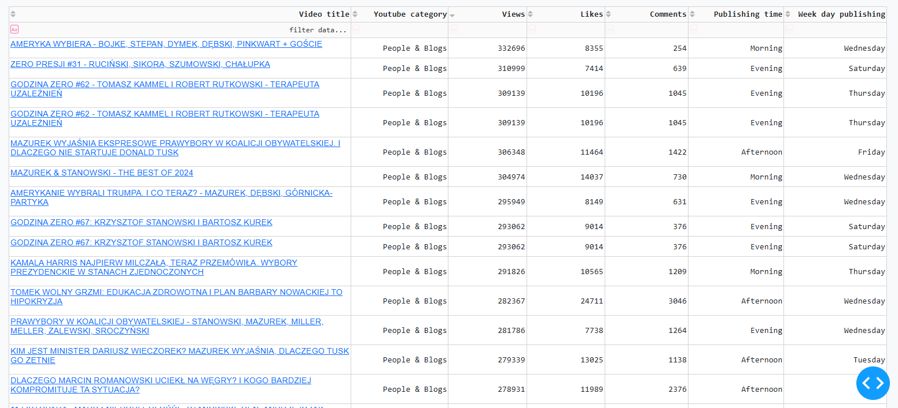

# YouTube Dashboard Project

## 📋 Overview
This project provides a robust data visualization dashboard for analyzing YouTube channel statistics. It integrates data processing, a user-friendly interactive dashboard built with Dash and Plotly, and a structured backend architecture to handle the required computations and transformations.



---

## 🌟 Features
- **Automated Data Retrieval**: Fetches data using the Google API.
- **Data Processing**: Cleans and transforms raw YouTube data for streamlined use in visualizations.
- **Interactive Dashboard**: Provides dynamic charts, filters and tables for intuitive exploration of video statistics.
- **KPI Metrics**: Displays key performance indicators such as average views, likes, and comments.
- **Customizable Filters**: Allows users to slice data based on date, category, and video duration.
---

## 🔧 Technology

- Python 3.8+
- Dash
- Pandas
- Plotly
- Requests (to API)


## 🔍 Project Structure
```
.
├── data
│   ├── data_processed         # Contains processed data files.
│   ├── images                 # Stores images used in the dashboard (e.g., logos).
│   └── raw_data               # Raw input data files.
│
├── src
│   ├── api                    # Backend API module.
│   │   ├── __init__.py
│   │   └── main.py            # API endpoint definitions.
│   │
│   ├── config                 # Configuration files.
│   │   ├── __init__.py
│   │   └── logging_config.yaml
│   │
│   ├── dashboard              # Dashboard modules.
│   │   ├── __init__.py
│   │   ├── callbacks.py       # Callback functions for interactive dashboard components.
│   │   ├── layout.py          # Defines the layout of the dashboard.
│   │   └── utilities.py       # Helper functions for dashboard.
│   │
│   ├── data_processing        # Data transformation and preprocessing.
│   │   ├── __init__.py
│   │   └── utilities.py       # Data cleaning and filtering logic.
│   │
│   ├── logs                       # Stores application logs.
│   │   └── project.log
│   └── main.py
├── .env                       # Environment variables.
├── .env.share                 # Environment variables for sharing.
├── .gitignore                 # Git ignore file.
├── README.md                  # Project documentation.
└── requirements.txt           # Python dependencies.
```

---

## Setup Instructions

### Prerequisites
- Python 3.8 or higher
- pip (Python package manager)
- Recommended: Virtual environment tool (e.g., `venv` or `conda`)

### Installation
1. **Clone the Repository**:
   ```bash
   git clone <repository_url>
   cd <repository_name>
   ```

2. **Set Up Virtual Environment**:
   ```bash
   python -m venv venv
   source venv/bin/activate  # On Windows: venv\Scripts\activate
   ```

3. **Install Dependencies**:
   ```bash
   pip install -r requirements.txt
   ```

4. **Set Up Environment Variables**:
   - Copy `.env.share` to `.env`.
   - Update `.env` with your configurations. Define: 
     - 1.API_KEY - API key generated by YouTube. 
     - 2.CHANNEL_ID - YouTube channel_id that you gone analyse.

5. **Run the Application**:
   ```bash
   python src/main.py
   ```

6. **Access the Dashboard**:
   Open your web browser and navigate to `http://127.0.0.1:8050`.

---

## Key Modules

### 1. **Data Processing**
Located in `src/data_processing/utilities.py`:
- `load_data(filepath: str)`: Loads raw data and prepares it for analysis.
- `data_filter(...)`: Filters data based on user-selected parameters like date range, categories, and duration.

### 2. **Dashboard Layout**
Located in `src/dashboard/layout.py`:
- Defines the structure and layout of the dashboard, including KPIs, filters, and graphs.

### 3. **Callbacks**
Located in `src/dashboard/callbacks.py`:
- Manages interactivity for dashboard components, ensuring dynamic updates based on user inputs.

### 4. **Configuration**
Located in `src/config`:
- `logging_config.yaml`: Centralized configuration for application logging.

---

## Logging
Logs are stored in the `logs/project.log` file. Logging configurations can be customized in `src/config/logging_config.yaml`.

---

## Future Enhancements
- Improve responsiveness for mobile devices.
- Integrate additional APIs for enriched insights.
- Enable export of filtered data.

---

## Contact
For questions or support, please contact me at [arkadiusz.kostrzewa92@gmail.com].

---
